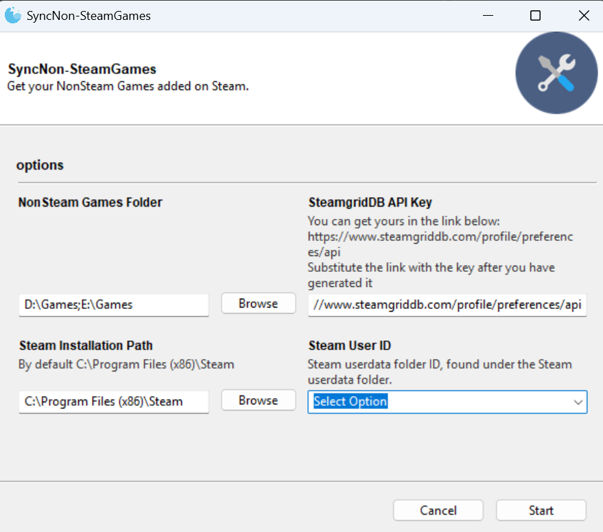

# SyncNon-SteamGames
A modified version of GameSync from Maikeru86 (https://github.com/Maikeru86/GameSync)

Automatically add Non-Steam Games to Steam with images from SteamGridDB




## Features
- Reads games from a specified installation directory.
- Generates unique AppIDs for non-Steam games.
- Fetches grid, hero, and logo images from SteamGridDB.
- Adds new games to Steam shortcuts.
- Removes shortcuts for games that are no longer installed, but only if they were originally created by SyncNon-SteamGames.
- Finds largest .exe in game folder and adds that as the game executable.
- Logging
- Changed the shown name in Steam of the games to be the name from steamgrid instead of the executable name
- Added GUI
- Automatically uses the only available Steam userdata folder, or lets you select the Steam user ID when multiple accounts are detected.
- Storage of the variables in `%APPDATA%\SyncNonSteamGames\parameters.json`
- Changed slightly the messages to be logged, now it informs if a titles is being skipped when it's already present in steam.
- Added exceptions to the names of executables to be found, to avoid using the wrong one in Unity games
- Multi folder support
- CLI support with the argument `--cli` thanks to [`@pwilinchery`](https://github.com/IGnGr/SyncNon-SteamGames/pull/2)

## Limitations:
- The executable is located by size, which is not ideal. At this moment, the user must change the executable in Steam directly if the wrong one has been chosen.


## Requirements
- NonSteam Games Folder: Path to the directory where your Non-Steam games are installed.
- SteamGridDB API Key: You have to generate one for yourself here: https://www.steamgriddb.com/profile/preferences/api
- Steam Installation path: Path where Steam is installed in your system.
### Using source

- Install the required libraries
```py
pip install -r requirements.txt
```

If installation of Gooey fails on Linux, please run following command to install required dependencies (for Debian 13 Trixie):
```bash
sudo apt install libgtk-3-dev python-config
```

- Execute the script "SyncNon-SteamGames.py"


## Usage
- Download the packaged version from "Releases"
- Make sure the directories and SteamGridDB API fields are filled in.
- If multiple Steam accounts are found in the Steam `userdata` folder, select the Steam user ID to update.
- Run it

For CLI usage, pass `--steam_user_id` when multiple Steam userdata folders exist:
```bash
python SyncNon-SteamGames.py --cli --steam_user_id 12345678
```

## Tips
If your library is huge and you are having difficulties locating the games, here is how you can find them easily  until Valve provides a filter in desktop mode (Only big picture has a filter for non-steam games):
- Enable the option to show only installed games
- Create 3 dynamics library: 
    - Single Player
    - Multi Player
    - Co op

    This should narrow the games in your "Uncategorized" section to be basically the ones we're looking for
- Create a new library on "Non-Steam" steam and add them
- Congratulations! your games are categorized and easily accessible

## Release notes
The GitHub release workflow is triggered by pushing a git tag in `vX.Y.Z` format, for example `v1.4.1`.

Example:
```bash
git tag v1.4.1
git push origin v1.4.1
```

Make sure `CHANGELOG.md` contains a matching heading like `## [v1.4.1]` before pushing the tag.


## 3rd Party libraries
- "Gooey" for the GUI (https://github.com/chriskiehl/Gooey)
- "Pyinstaller" for building the executable (https://github.com/pyinstaller/pyinstaller)
- "vdf" to read Valve's config files https://pypi.org/project/vdf/
- "requests" to handle the network side of thing  https://pypi.org/project/requests/
